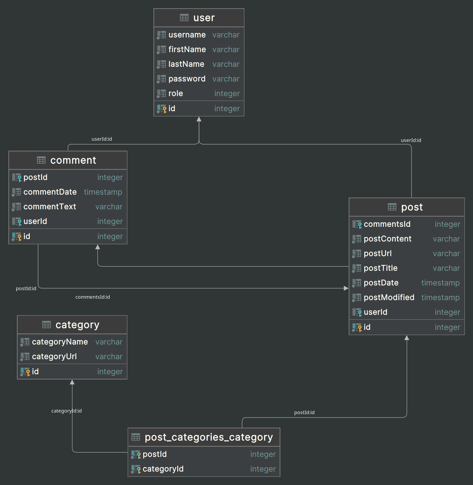

# Maxim Ivanov M33081

[Link](https://ado-web-sem-6.onrender.com/)

## Description
This website represents musician blog


## Domain Model



* **Users** - The administrators and readers
* **Posts** - Pages and posts
* **Comments** - Comments on each post
* **Categories** - Topic categories

### User

* **id** - Primary key.
* **username** - User's username. Should be unique in order to prevent duplicates.
* **firstName** - 1/2 of user's full name.
* **lastName** - 1/2 of user's full name.
* **password** - User's password. 
* **role** - User's role. Can be ADMIN or USER.

#### User's Relations

```
@OneToMany(type => Post, post => post.user)
posts: Post[];
```

### Post
* **id** - Primary key.
* **commentsId** - Foreign key. Id's of belonging comments.
* **userId** - Foreign key. Id of the post creator.
* **postContent** - Post contents.
* **postUrl** - The URL of the post. 
* **postTitle** - Heading of the post.
* **postDate** - Date of post creation.
* **postModified** - Date of the last post modification.

#### Post's Relations

```
  @ManyToOne(type => User, user => user.posts)
  user: User;

  @ManyToOne(type => Comment, comment => comment.post)
  comments: Comment[];
```

### Category
* **id** - Primary key.
* **categoryName** - Name of the category.
* **categoryUrl** - The URL of the category.

### Posts to Categories

There's also a _"post_categories_category"_ **Join Table**, which attaches **Categories** to **Posts** in _src/post/entities/post.entity.ts_.

```
  @ManyToMany(() => Category)
  @JoinTable()
  categories: Category[];
```

